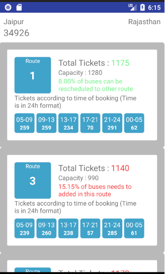
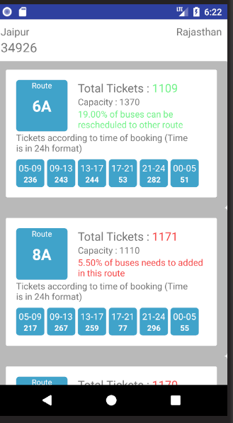

# mTravellerSurveiliance
This project is about visualization and analysis of data of tickets done by mTraveller Conductor App.
This App can store, Visualize and analize when, where and how many tickets have been done in particular city
<h3 align="center">
  Below are the screenshot of the App.
  </h3>

  
  

### From above screenshot we can see that the detailed information about particular city is shown in Creative manner.
### In Summary, percentage of excess/lack of transport is calculated and shown for each route.
